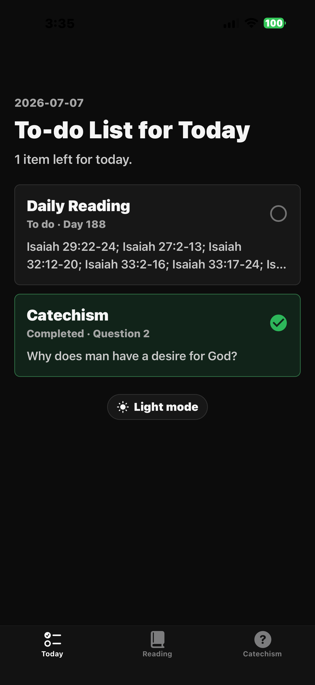
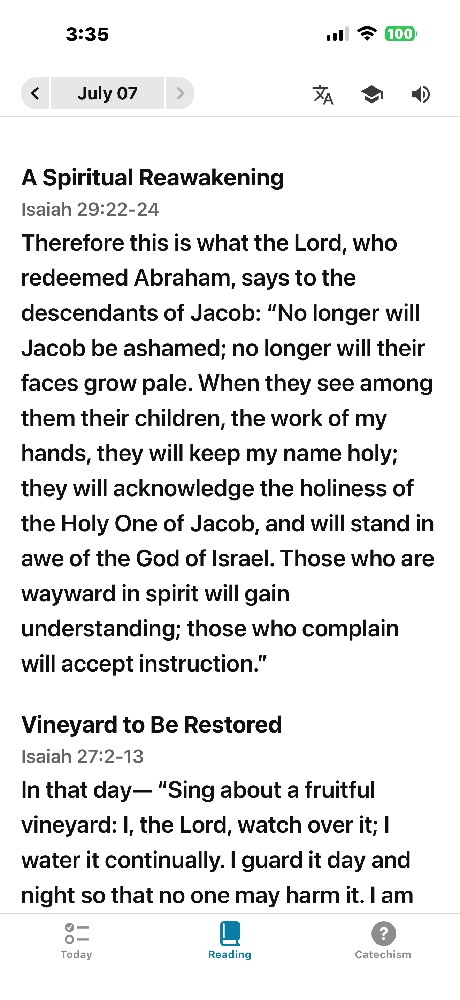
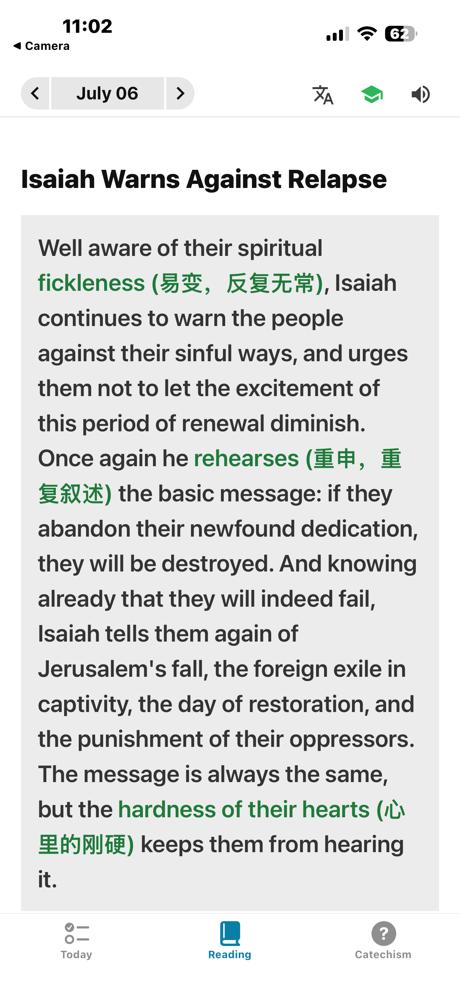
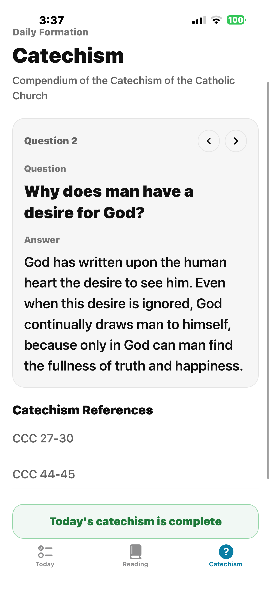

# Daily Bible

Daily Bible 是一个面向日常灵修的 Expo 应用。它把每天的圣经阅读、英文经文学习、中文辅助翻译、朗读和天主教教理问答放在同一个简单的流程里：打开应用，看见今天要完成的两件事，读完经文和教理后标记完成，第二天继续。

这个应用特别适合想用英文读经、同时需要中文释义帮助的用户。阅读页可以在英文原文、中文翻译和英文难词注释之间切换，也可以直接朗读当天内容。

## 应用预览

### 今日清单

首页是每天的入口。它会显示当前日期、今日读经任务、今日教理问题，以及还有几项没有完成。已完成的任务会以绿色状态显示，用户也可以在这里一键切换深色模式。

| 浅色模式 | 深色模式 |
| --- | --- |
|  |  |

今日清单里的读经卡片会显示计划天数和当天经文章节摘要，例如 Day 188 和以赛亚书相关段落。教理卡片会显示当天问题，并和读经任务一起被记录为当天进度。

### 每日读经

读经页顶部提供日期切换、翻译、词汇学习和朗读入口。正文按主题和经文段落组织，先显示当天主题，再列出对应经文章节。用户可以阅读英文经文，也可以切换为中文译文。

| 英文阅读 | 中文翻译 |
| --- | --- |
|  |  |

### 英文词汇辅助

学习模式会分析当天经文中的难词、短语或修辞表达，并把中文释义直接标在英文正文里。这样用户不用离开阅读上下文，也能理解重点词汇。



### 完成反馈

读到页面底部后，可以标记当天读经完成。完成时应用会显示彩色庆祝动效，并把按钮状态改成完成提示。这个进度会保存在本地，回到首页后今日清单也会同步更新。

| 标记完成 | 完成后的状态 |
| --- | --- |
|  |  |

### 教理问答

教理页提供每日一个问题和答案，内容来自《天主教教理纲要》。用户可以用左右按钮切换问题，查看对应的 CCC 参考条目，并将当天教理学习标记为完成。



## 主要功能

- 每日任务清单：把当天读经和教理学习合并到一个 Today 页面。
- 按日期的读经计划：根据日期展示对应的阅读日、主题和经文章节。
- 英文经文阅读：内置圣经文本数据，并按段落显示章节引用。
- 中文翻译：通过应用内 API route 调用 Google Translate，将当天内容翻译为简体中文。
- 词汇注释：通过 Gemini 分析英文难词，并在原文里以内联中文释义高亮展示。
- 朗读播放：使用 `expo-speech` 朗读当天内容，支持暂停、继续、前后跳段和语速调整。
- 完成记录：使用本地存储保存每天的读经和教理完成状态。
- 教理学习：每日展示《天主教教理纲要》问答和 CCC 参考。
- 深色模式：在首页切换浅色和深色阅读体验。

## 技术栈

- Expo SDK 54
- React 19
- React Native 0.81
- Expo Router
- Zustand
- Expo Speech
- Expo SQLite
- Google Cloud Translation API
- Gemini API

## 本地运行

安装依赖：

```bash
npm install
```

复制环境变量文件，并按需填写 API Key：

```powershell
Copy-Item .env.example .env
```

启动 Expo：

```bash
npm run start
```

如果本机网络依赖本地代理或 VPN，可以使用代理辅助脚本启动：

```bash
npm run start:proxy
```

运行检查：

```bash
npm run lint
npx tsc --noEmit
```

## 环境变量

翻译和词汇分析功能依赖外部 API。没有配置这些 Key 时，基础读经、教理和进度功能仍然可以使用，但翻译和词汇分析会返回配置错误。

```env
GOOGLE_TRANSLATE_API_KEY=
GOOGLE_TRANSLATE_BASE_URL=https://translation.googleapis.com/language/translate/v2
GOOGLE_TRANSLATE_TARGET_LANGUAGE=zh-CN
EXPO_PUBLIC_TRANSLATE_API_ORIGIN=
DEV_PROXY_URL=
GEMINI_API_KEY=
GEMINI_VOCAB_MODEL=gemini-3.5-flash
GEMINI_API_BASE_URL=https://generativelanguage.googleapis.com/v1beta/interactions
```

## 项目结构

- `app/`：Expo Router 路由和 API routes。
- `app/(tabs)/`：Today、Reading、Catechism 三个底部标签页。
- `app/api/translate+api.ts`：Google Translate 翻译接口。
- `app/api/vocabulary+api.ts`：Gemini 词汇分析接口。
- `src/features/home/`：今日任务清单。
- `src/features/reading/`：每日读经页面、日期计划和朗读交互。
- `src/features/catechism/`：教理问答数据和页面。
- `src/features/progress/`：本地完成状态和庆祝动效。
- `src/data/bible/`：圣经文本和查询工具。
- `src/data/reading-plan/`：每日读经计划 JSON。
- `photos/`：README 使用的应用截图。
