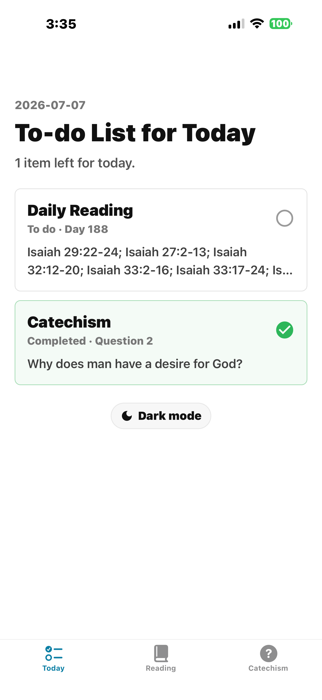
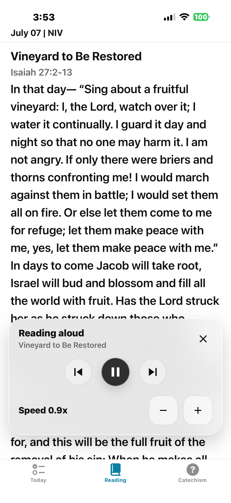
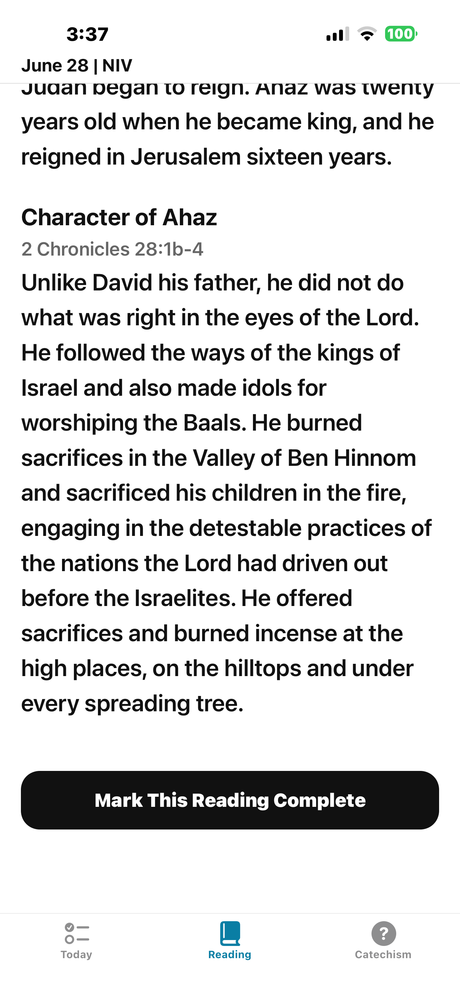
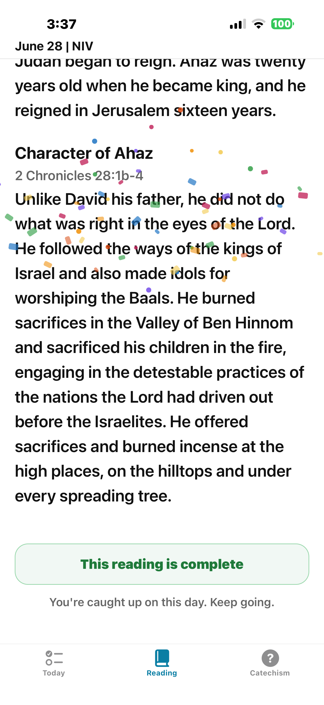
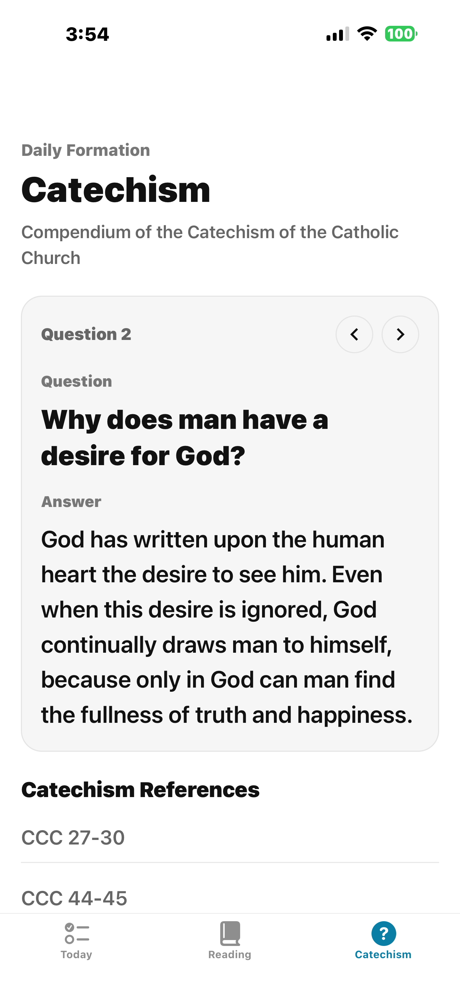
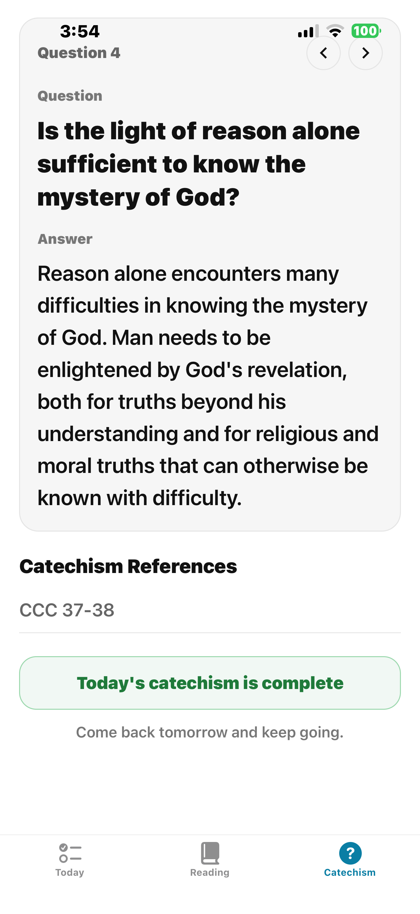

# Copyright Notice / 版权声明

English: This is a small personal project made for fun and learning. There is no intention to infringe any copyright or other rights. If anything is inappropriate, please contact haochengcs@gmail.com and I will remove the file(s) or folder(s) that violate copyright.

中文：这是一个个人做着玩和学习用的小项目，无意侵犯任何版权或其他权利。如有不妥，请联系 haochengcs@gmail.com，我会撤下违反版权的 file 或 folder。

# Daily Bible

Daily Bible is a mobile-first Expo app for building a steady daily rhythm of Scripture reading, assisted English study, text-to-speech listening, and catechism formation.

中文：Daily Bible 是一款每日灵修应用，把读经、英文学习、朗读和教理问答放在同一个清晰流程里。

## Preview

### Today Checklist

The Today tab gives each day a simple shape: finish the daily Bible reading, finish the catechism question, and come back tomorrow. Completed items are highlighted in green, and the same screen includes a quick light/dark mode switch.

中文：首页展示当天待读事项，包括每日读经和教理学习，并同步显示完成状态。

| Light mode | Dark mode |
| --- | --- |
|  |  |

### Daily Reading

The Reading tab follows a date-based reading plan. Each day includes a title, references, and Scripture passages. The top toolbar lets readers move between available dates, request Chinese translation, analyze vocabulary, and start audio playback.

中文：读经页按照日期展示每日经文，可以切换日期、翻译、学习词汇，也可以朗读经文。

| English Scripture | Chinese translation |
| --- | --- |
|  |  |

### Vocabulary Study

The study mode uses Gemini to identify difficult English words, idioms, and contextual phrases, then adds concise Simplified Chinese explanations directly inside the English passage. This keeps the learning aid close to the verse instead of sending readers to another app.

中文：学习模式会把英文难词和短语标注在原文中，并给出简洁中文释义。


### Audio Reading

The reading screen includes a floating audio player powered by `expo-speech`. It supports pause/resume, previous and next passage controls, and adjustable reading speed.

中文：朗读浮层支持暂停、前后跳段和语速调整，方便边听边读。



### Completion Flow

At the bottom of a reading, the user can mark the day complete. The app saves progress locally, updates the Today checklist, and shows a lightweight celebration state when the task is done.

中文：完成读经后会保存本地进度，并用绿色状态和庆祝动画反馈当天已完成。

| Complete action | Completion state |
| --- | --- |
|  |  |

### Catechism Formation

The Catechism tab presents a balanced daily section from the Simplified Chinese Catechism of the Catholic Church. Its date navigation, collapsible header, reading width, and completion flow mirror the Reading tab.

中文：教理页每天展示按字数均衡分配的简体中文《天主教教理》，并采用与 Reading 一致的日期导航和阅读布局。

| Catechism reading | Completed catechism |
| --- | --- |
|  |  |

## Features

- Daily checklist for Scripture and catechism tasks. 中文：每日读经和教理任务清单。
- Date-based Bible reading plan with section titles and Scripture references. 中文：按日期组织的读经计划。
- Built-in English Scripture text and lookup helpers. 中文：内置英文圣经文本。
- Chinese translation through an Expo API route backed by Google Cloud Translation. 中文：通过 Google 翻译生成中文译文。
- Gemini-powered vocabulary annotations for Chinese-speaking English Bible readers. 中文：Gemini 辅助英文难词中文注释。
- Text-to-speech playback with passage navigation and speed controls. 中文：支持朗读、跳段和语速调整。
- Local progress storage for completed daily tasks. 中文：本地保存每日完成进度。
- A balanced 365-day Simplified Chinese Catechism plan covering CCC 1-2865 in order. Short entries are grouped together so each day has a similar reading length. 中文：将 2865 条简体中文《天主教教理》按字数均衡分配到 365 天。
- Light and dark reading modes. 中文：支持浅色和深色模式。

## Tech Stack

- Expo SDK 54
- React 19
- React Native 0.81
- Expo Router
- Zustand
- Expo Speech
- Expo SQLite
- Google Cloud Translation API
- Gemini API
- Undici for server-side proxy support

## Getting Started

Install dependencies:

```bash
npm install
```

Create a local environment file:

```powershell
Copy-Item .env.example .env
```

Start Expo:

```bash
npm run start
```

If your network requires a local proxy or VPN proxy for Google/Gemini services, set `DEV_PROXY_URL` in `.env` and start with:

```bash
npm run start:proxy
```

Run checks:

```bash
npm run lint
npx tsc --noEmit
```

## Environment Variables

Translation and vocabulary analysis require external API credentials. The core reading, catechism, and progress features can still run without these keys, but translation and vocabulary analysis will show configuration errors until the keys are set.

中文：翻译和词汇分析需要外部 API Key；基础读经、教理和进度功能不依赖这些 Key。

```env
GOOGLE_TRANSLATE_API_KEY=
GOOGLE_TRANSLATE_BASE_URL=https://translation.googleapis.com/language/translate/v2
GOOGLE_TRANSLATE_TARGET_LANGUAGE=zh-CN
EXPO_PUBLIC_TRANSLATE_API_ORIGIN=
DEV_PROXY_URL=
GEMINI_API_KEY=
GEMINI_VOCAB_MODEL=gemini-3.5-flash
GEMINI_API_BASE_URL=https://generativelanguage.googleapis.com/v1beta/interactions
```

## Project Structure

- `app/`: Expo Router routes and API routes.
- `app/(tabs)/`: Today, Reading, and Catechism tabs.
- `app/api/translate+api.ts`: Google Cloud Translation route.
- `app/api/vocabulary+api.ts`: Gemini vocabulary analysis route.
- `src/features/home/`: Today checklist experience.
- `src/features/reading/`: Daily reading screen, date plan logic, translation, vocabulary, and audio playback.
- `src/features/catechism/`: Daily Catechism reader and date mapping.
- `src/features/progress/`: Local completion state and celebration overlay.
- `src/data/bible/`: Bible text and lookup utilities.
- `src/data/reading-plan/`: Daily reading plan JSON files.
- `src/data/catechism-source/`: Simplified Chinese JSON converted from the 43 source Catechism PDFs, plus the generated balanced 365-day reading plan. The original PDFs are intentionally not kept in the repo.
- `screenshots/`: README screenshots with descriptive filenames.
